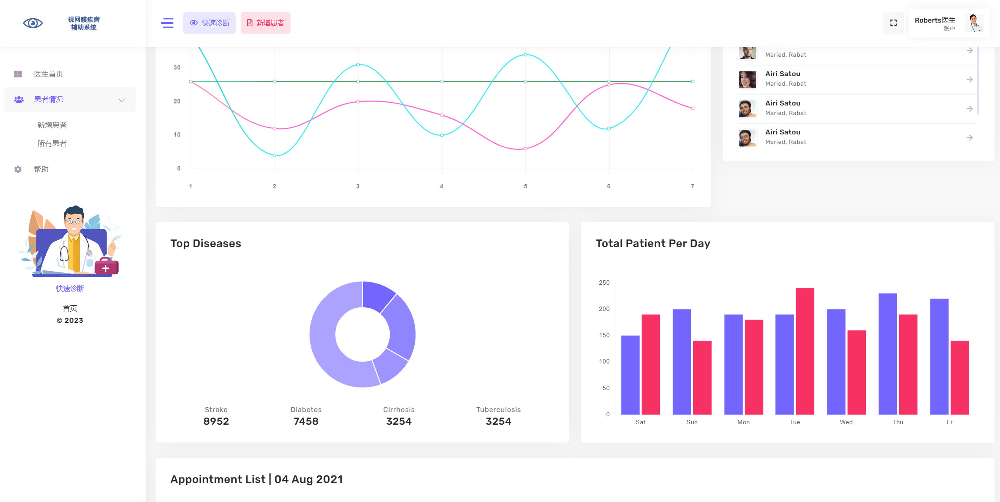

# 项目简介
在2022 IEEE International Conference on Bioinformatics and Biomedicine (BIBM)（CCF B）主会发表会议论文一篇，原文见链接 https://ieeexplore.ieee.org/document/9995218 。
开发了一套原型系统，可以供给相关配套设备医院使用，界面如下图。

## 项目背景
糖尿病视网膜病变（DR）与年龄相关性黄斑病变（AMD）是导致视力下降的重要原因。DR是糖尿病后期可出现在眼部的疾病，据统计全世界有2.85亿糖尿病患者，其中约1/3有DR迹象，另外1/3的DR患者直接威胁视力。AMD是黄斑区结构的衰老性病变，仅在美国，43-86岁的成年人估计15年早期AMD的累计发病率为14.3%。

光学相干断层扫描（OCT）是一种非入侵光学成像方式，能够清晰捕获视网膜血管信息乃至病例信息。

在绝大多数情况下仅依靠医生诊断上述病症，昂贵且耗时。目前深度学习越来越广泛的被用于各类疾病分析，并且在减少时间和成本的同时也取得了良好的效果。

## 项目结构简介
IPN目录下是TCAM-ResNet网络源码，以及相关实验中的其他模型源码

app与Intelligent_analysis_of_fundus_OCTA_images目录是原型系统开发的源码，包括前端源码，前后端交互等等

## 项目主要技术

为了实现将DR与AMD进行分类，并达到良好的效果，我们利用了TCAM-Resnet，该网络以
ResNet为基础，加入了三维卷积注意力机制（TCAM），该注意力机制聚焦于视网膜血管信息，
能够提取三维图像的血管权重信息。本研究中使用的数据集来自于Image Projection Network: 3D to 2D Image Segmentation in OCTA Images 原文见 https://ieeexplore.ieee.org/document/9085991 
在这篇论文中，IPN投影网络本是将三维OCTA图片进行投影，获得二维血管图片。我们在研究中IPN投影网络进行改造
获得能够提取三维OCT图像血管信息的注意力机制，使得整个网络的准确率得到极大提升，TCAM的加入，使Resnet3d在疾病分类任务上，获得了更高的精度，AMD，DR，NORMAL三分类准确率达到83.3%，AMD，NORMAL二分类准确率达到98%。

使用HTML+CSS+JavaScript 以及Python Django框架进行原型系统搭建。
